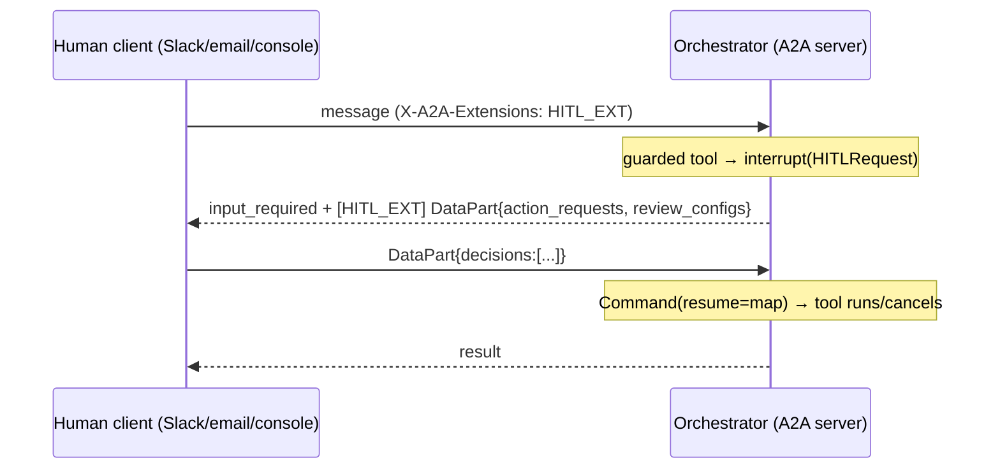
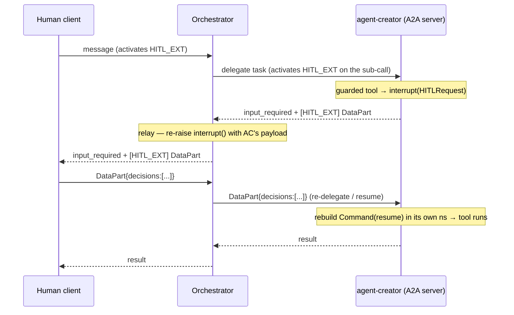

# Human-in-the-Loop over multi-hop A2A (`urn:nannos:a2a:human-in-the-loop:1.0`)

**Status:** Design / proposal
**Scope:** Extend the HITL extension from the orchestrator-only (single-hop) model to a relayed,
multi-hop model. **agent-creator is the first adopter** of the server-emit half.
**Audience:** anyone working on `ringier-a2a-sdk` server stack, the orchestrator executor/relay, or
a remote agent (agent-creator, agent-runner, voice-agent).

---

## 1. What the extension is

`urn:nannos:a2a:human-in-the-loop:1.0` is a single client↔server **contract** carried over A2A. It
lets an agent pause before executing a guarded tool, ask a human to approve/edit/reject, and resume
with that decision. It is **not** a client-only concept — it has a server-emit half and a
client-render half.

Canonical message shapes (see [`a2a_extensions.py`](../packages/orchestrator-agent/app/core/a2a_extensions.py)):

**Server → client** (status update, `state=input_required`, `Message.extensions=[HITL_EXT]`):

```jsonc
// DataPart payload
{
  "action_requests": [
    { "name": "create_agent", "args": { "...": "...", "_call_id": "toolcall_abc" }, "description": "..." }
  ],
  "review_configs": [
    { "action_name": "create_agent", "allowed_decisions": ["approve", "edit", "reject"] }
  ]
}
```

**Client → server** (reply message DataPart):

```jsonc
{ "decisions": [ { "type": "approve" } ] }
// edit:   { "type": "edit", "edited_action": { "name": "...", "args": { ... } } }
// reject: { "type": "reject", "message": "reason" }
```

`_call_id` on each action_request is what aligns decisions back to the originating tool call
([`executor._action_request_call_id`](../packages/orchestrator-agent/app/core/executor.py),
[`conditional_hitl.py`](../packages/agent-common/agent_common/middleware/conditional_hitl.py)).

---

## 2. Where it works today (single-hop) vs the target (multi-hop)

### Today — only the orchestrator speaks the extension



The orchestrator implements the **full server half**:
- declares it in its AgentCard — [`main.py` `AgentExtension(uri=HUMAN_IN_THE_LOOP_EXTENSION,…)`](../packages/orchestrator-agent/main.py)
- gates emission on activation — [`executor.py` `if action_requests and _ext_active(HUMAN_IN_THE_LOOP_EXTENSION)`](../packages/orchestrator-agent/app/core/executor.py)
- builds the structured message — `new_hitl_interrupt_message(...)`
- parses the reply — `_extract_hitl_decisions`, `_build_interrupt_resume_map`

Remote agents (agent-creator, agent-runner) are built on the **SDK server stack** and do **not**
speak the extension. When the orchestrator delegates a tool to agent-creator, only the orchestrator's
own `ConditionalHITL` (scoring the `task` delegation) can interrupt — agent-creator's *internal* tool
calls run unguarded.

### Target — relayed HITL across hops



Key invariant (already encoded in
[`_build_subagent_resume_command` docstring](../packages/orchestrator-agent/app/middleware/dynamic_tool_dispatch.py)):
the resume `Command` never crosses the wire — **each hop resumes its own LangGraph checkpoint in its
own namespace**, coordinated only by the A2A `{decisions:[...]}` DataPart and a stable `context_id`.
agent-creator's interrupt + resume live entirely in **agent-creator's own Postgres checkpoint DB**
(thread `{context_id}::agent-creator`).

---

## 3. Gap analysis (what's missing)

| # | Layer | Gap | Evidence |
|---|-------|-----|----------|
| G1 | SDK model | `BaseAgentStreamResponse` has only `state/content/metadata` — no `action_requests`/`review_configs` | [`models.py`](../packages/ringier-a2a-sdk/ringier_a2a_sdk/models.py) (orchestrator subclass adds them in `responses.py`) |
| G2 | SDK agent stream | On `final_state.interrupts` it yields a generic `"Process interrupted…"` text, dropping the HITL payload | [`langgraph.py:1064`](../packages/ringier-a2a-sdk/ringier_a2a_sdk/agent/langgraph.py#L1064) |
| G3 | SDK agent stream | **No resume path** — `_stream_impl` always does `astream({"messages": …})`; cannot resume an interrupted graph | [`langgraph.py:898`](../packages/ringier-a2a-sdk/ringier_a2a_sdk/agent/langgraph.py#L898) |
| G4 | SDK executor | `input_required` branch emits plain text only; no structured DataPart, no activation gate | [`server/executor.py:413`](../packages/ringier-a2a-sdk/ringier_a2a_sdk/server/executor.py#L413) |
| G5 | SDK executor | `execute()` always treats the incoming message as new input; no `{decisions:[...]}` → resume detection | [`server/executor.py:88`](../packages/ringier-a2a-sdk/ringier_a2a_sdk/server/executor.py#L88) |
| G6 | agent-creator | No HITL middleware installed (`_get_middleware` inherits base = no `ConditionalHITL`) | [`agent/core.py`](../packages/agent-creator/agent/core.py) |
| G7 | agent-creator | AgentCard declares no extensions (`AgentCapabilities(streaming=True)`) | [`main.py`](../packages/agent-creator/main.py) |
| G8 | Orchestrator relay | For a **remote** sub-agent, the orchestrator detects pending interrupts via `aget_tuple` on its **own** checkpointer — that only works for in-process local agents. A remote agent's HITL arrives as an A2A `input_required` message and must be relayed from there | [`dynamic_tool_dispatch.py:1729`](../packages/orchestrator-agent/app/middleware/dynamic_tool_dispatch.py#L1729), [`client_runnable.py:728`](../packages/agent-common/agent_common/a2a/client_runnable.py#L728) |
| G9 | Activation | The orchestrator-as-client does not (verified-absent) activate `X-A2A-Extensions` on sub-agent calls; without it a strict `_ext_active` gate on agent-creator would suppress emission | no `X-A2A-Extensions` handling found in `client_runnable.py` |

G1–G7 are the **first-adopter (server-emit) work**. G8–G9 are the **relay work** required before a
multi-hop HITL is actually visible to the human; until G8/G9 land, agent-creator can emit HITL but the
orchestrator won't surface a *remote* agent's request.

---

## 4. Design

### 4.1 Lift the server-emit half into the SDK (don't fork it)

The orchestrator already has a correct, battle-tested implementation. Move the reusable pieces down
into `ringier-a2a-sdk` so every agent server shares one implementation:

- **Message builders + URIs** → move `HUMAN_IN_THE_LOOP_EXTENSION` and `new_hitl_interrupt_message`
  (and the sibling extension constants) from `orchestrator-agent/app/core/a2a_extensions.py` into
  `ringier_a2a_sdk` (e.g. `ringier_a2a_sdk/a2a/extensions.py`). Re-export from the orchestrator module
  to avoid churn.
- **Stream model fields (G1)** → add optional `action_requests` / `review_configs` to
  `BaseAgentStreamResponse`. The orchestrator's `AgentStreamResponse` subclass then just inherits them.
- **Executor emit (G4)** → port the `input_required` structured branch from the orchestrator executor
  into `BaseAgentExecutor._handle_stream_item`, gated by a shared `_ext_active(...)` helper.
- **Activation helper** → a single `is_extension_active(context, uri)` reading the activated
  extensions from `context.call_context` (the orchestrator already reads `context.call_context.state`
  for auth — same source).

### 4.2 Teach the SDK agent to emit and to resume (G2, G3)

- **Emit (G2):** in `_stream_impl`, when `final_state.interrupts` is non-empty, read the interrupt
  value (`intr.value`), pull `action_requests` / `review_configs` out of the `HITLRequest`, and yield
  an `AgentStreamResponse(state=INPUT_REQUIRED, content=<description>, action_requests=…,
  review_configs=…)` instead of the generic text.
- **Resume (G3, the biggest lift):** `_stream_impl` must accept a resume value and, when present, call
  `astream(Command(resume=resume_map), config, …)` instead of `astream({"messages": …}, …)`. Mirror
  the orchestrator's `_build_interrupt_resume_map` (interrupt-id-keyed map for LangGraph ≥1.2
  multi-interrupt safety). The graph is already checkpointed (agent-creator uses
  `PostgreSQLCheckpointerMixin`), so resume reads the pending interrupt from
  `{context_id}::agent-creator` in agent-creator's own DB.

### 4.3 Resume detection at the SDK executor (G5)

`BaseAgentExecutor.execute()` must distinguish a **decision reply** from a **new turn**:

1. Parse the incoming message for a `{decisions:[...]}` DataPart (lift `_extract_hitl_decisions`).
2. If present, load graph state (`graph.aget_state(config)`); if it has `interrupts`, build the
   resume map (lift `_build_interrupt_resume_map`) and pass it into `agent.stream(..., resume=…)`.
3. Otherwise, behave as today (new messages).

This is exactly what the orchestrator executor already does at
[`executor.py:586-601`](../packages/orchestrator-agent/app/core/executor.py#L586) — the goal is to
share, not duplicate.

### 4.4 Orchestrator relay for remote sub-agents (G8, G9)

For multi-hop to reach the human:

- **Activate downstream (G9):** when the orchestrator delegates to a sub-agent it should activate
  `HITL_EXT` on that sub-call (set `X-A2A-Extensions`) so a strict `_ext_active` gate on agent-creator
  passes. (Alternatively, the first adopter emits unconditionally and we defer strict gating — see
  Open Questions.)
- **Relay up (G8):** when `A2AClientRunnable` sees `input_required` with `HITL_EXT`, extract
  `action_requests`/`review_configs` from the message DataPart (it already decodes data parts at
  [`client_runnable.py:289`](../packages/agent-common/agent_common/a2a/client_runnable.py#L289)) and
  feed that payload into the orchestrator's own `interrupt(...)` so the orchestrator re-emits HITL to
  the human. Today the orchestrator's pending-interrupt detection for sub-agents is checkpoint-based
  (`aget_tuple`) which only covers in-process local agents; the remote path must be message-based.
- **Relay the decision back down:** on the human's reply, re-delegate to the sub-agent with a
  `{decisions:[...]}` DataPart. The remote rebuilds its own `Command(resume=…)` (the documented
  contract), so the orchestrator sends the plain payload unchanged.

---

## 5. Concrete plan — agent-creator as first adopter

Phased so each step is independently testable. Phases 1–3 make agent-creator emit/resume HITL as a
**direct** A2A server (testable with a raw A2A client, no orchestrator). Phase 4 wires the
orchestrator relay so it reaches a real human. Phase 5 hardens.

### Phase 0 — Prereqs / safety
- [ ] Confirm agent-creator's checkpointer is real Postgres in every environment (the silent
  `MemorySaver` fallback would drop a pending approval on resume). Treat the "every replica → same
  checkpoint DB" invariant as a hard requirement; ideally make the missing-host fallback fail-fast
  outside local dev. (See the checkpointer review notes.)

### Phase 1 — SDK plumbing (shared, no behavior change yet)
- [ ] G1: add optional `action_requests: list | None`, `review_configs: list | None` to
  `BaseAgentStreamResponse` ([`models.py`](../packages/ringier-a2a-sdk/ringier_a2a_sdk/models.py)).
- [ ] Move `HUMAN_IN_THE_LOOP_EXTENSION` + `new_hitl_interrupt_message` (+ siblings) into
  `ringier_a2a_sdk/a2a/extensions.py`; re-export from `orchestrator-agent/app/core/a2a_extensions.py`.
- [ ] Add `is_extension_active(context, uri)` helper in the SDK.

### Phase 2 — SDK server emit + resume (G2–G5)
- [ ] G2: `_stream_impl` emits structured `INPUT_REQUIRED` (action_requests/review_configs from the
  interrupt value) instead of generic text ([`langgraph.py:1064`](../packages/ringier-a2a-sdk/ringier_a2a_sdk/agent/langgraph.py#L1064)).
- [ ] G3: `_stream_impl` accepts a `resume` argument and calls `astream(Command(resume=…))` when set
  ([`langgraph.py:898`](../packages/ringier-a2a-sdk/ringier_a2a_sdk/agent/langgraph.py#L898)). Add a
  shared `build_interrupt_resume_map` util.
- [ ] G4: `BaseAgentExecutor._handle_stream_item` emits `new_hitl_interrupt_message` on `INPUT_REQUIRED`
  when `action_requests` present (+ activation gate) ([`server/executor.py:413`](../packages/ringier-a2a-sdk/ringier_a2a_sdk/server/executor.py#L413)).
- [ ] G5: `BaseAgentExecutor.execute` detects `{decisions:[...]}`, loads state, and resumes
  ([`server/executor.py:88`](../packages/ringier-a2a-sdk/ringier_a2a_sdk/server/executor.py#L88)).

### Phase 3 — agent-creator opts in (G6, G7)
- [ ] G6: override `AgentCreator._get_middleware()` to append a `ConditionalHumanInTheLoopMiddleware`
  (mirror [`graph_factory._create_hitl_middleware`](../packages/orchestrator-agent/app/core/graph_factory.py)),
  with `interrupt_on` static guards (start with the high-risk creator tools, e.g. `create_agent` /
  `update_agent`) and/or the DB-driven risk scorer.
- [ ] G7: add `extensions=[AgentExtension(uri=HUMAN_IN_THE_LOOP_EXTENSION, description=…)]` to
  agent-creator's `AgentCapabilities` ([`main.py`](../packages/agent-creator/main.py)).
- [ ] Smoke test agent-creator **directly** with an A2A client that activates `HITL_EXT`: guarded tool
  → `input_required` + DataPart → reply `{decisions:[approve]}` → tool runs and task completes.

### Phase 4 — orchestrator relay (G8, G9)
- [ ] G9: activate `HITL_EXT` on orchestrator→sub-agent calls (set `X-A2A-Extensions`), or decide on
  unconditional emit (Open Questions).
- [ ] G8: in the remote-agent path, extract HITL payload from the sub-agent's `input_required` A2A
  message and re-raise the orchestrator's own `interrupt(...)` with it; on the human's decision,
  re-delegate with the `{decisions:[...]}` DataPart. Reconcile with the existing local-agent
  `aget_tuple` path in [`dynamic_tool_dispatch.py`](../packages/orchestrator-agent/app/middleware/dynamic_tool_dispatch.py)
  so both local and remote sub-agents surface uniformly.
- [ ] End-to-end test: human client → orchestrator → agent-creator guarded tool → approval surfaces to
  the human → decision flows back → agent-creator resumes.

### Phase 5 — hardening
- [ ] Multi-interrupt / parallel tool calls: verify interrupt-id-keyed resume map across the hop.
- [ ] Reject / edit decision types round-trip correctly.
- [ ] Timeout / abandonment: a `input_required` task that never gets a decision (TTL, task GC).
- [ ] Decide PTC-guard scope (currently in-process `_PTC_TURNS`, **not** checkpointed) — out of scope
  here; document that PTC HITL remains pod-local.

---

## 6. Open questions / decisions

1. **Strict activation vs unconditional emit (G9).** Simplest first step: agent-creator emits the HITL
   DataPart unconditionally and the orchestrator (which always activates it for the human) relays it.
   Strict `_ext_active` gating on agent-creator only matters if non-orchestrator clients call
   agent-creator directly. Recommendation: ship unconditional emit in Phase 3, add the gate in Phase 4.
2. **Relay altitude (G8).** The cleanest fix generalizes sub-agent interrupt detection so local
   (`aget_tuple`) and remote (A2A message) agents flow through one path, rather than adding a remote
   special-case. Worth a small design spike before Phase 4.
3. **Where do `review_configs` come from for remote agents?** They originate in the sub-agent's
   `ConditionalHITL`; ensure the orchestrator relays the sub-agent's `review_configs` verbatim rather
   than synthesizing defaults, so `edit`/`reject` affordances survive the hop.
4. **Checkpoint durability.** This feature makes a *pending human decision* part of agent-creator's
   persisted state. The silent `MemorySaver` fallback turns a misconfigured replica into silent loss of
   in-flight approvals — fix the fallback (or fail-fast) before relying on multi-hop HITL in prod.

---

## 7. Reuse map (don't reinvent)

| Need | Reuse from |
|------|-----------|
| Message builder + URI | `a2a_extensions.new_hitl_interrupt_message`, `HUMAN_IN_THE_LOOP_EXTENSION` |
| Emit gate | `executor._ext_active` pattern |
| Decision parsing | `executor._extract_hitl_decisions` |
| Resume map (multi-interrupt safe) | `executor._build_interrupt_resume_map`, `_decisions_for_interrupt` |
| HITL middleware construction | `graph_factory._create_hitl_middleware`, `ConditionalHumanInTheLoopMiddleware` |
| Remote resume contract | `dynamic_tool_dispatch._build_subagent_resume_command` (docstring is the spec) |
